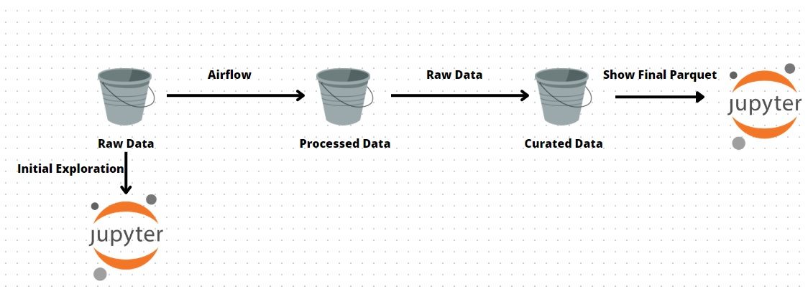

---
__Resumo do Projeto__

Projeto desenvolvido para o challenge-data-engineering MaisTodos

---
### Respostas
1.1 - Qual a coluna com maior desvio padrão?

1.2 - Qual valor mínimo e o máximo?

2.1 Tipos de Dados Processed

2.2 Resultado Final.

O jupyter foi executado no final do airflow.

### Arquitetura

Como já foi fornecido o csv como fonte crual dos dados, foi enviado para o s3 no bucket para armazenamento sem mudanças, as transformações iniciais foram aplicadas e enviadas para o bucket no formato csv e parquet e, por fim, a agregação foi feita e o arquivo csv e parquet foi enviado. 

#### Como executar o projeto

Imagem Airflow retirada do https://github.com/puckel/docker-airflow

Com o DockerHub intalado execute:

    docker-compose -f docker-compose-LocalExecutor.yml up -d

entre no terminal:

    docker exec -u root -t -i containerID /bin/bash

execute:

    pip install --upgrade pip
    pip install boto3

Apos criar o connector com a aws passando seu usuário e criar os buckets no s3 execute a dag.

#### Airflow

Airflow possue 6 task:
1) Carrega os dados cru para o bucket raw (datalake) no s3.
2) todas as transformações necessárias são aplicadas e armazenada localmente como csv e parquet
3) apos uma validação de colunas e tipos os dados os dados em csv e parquet são enviados para o bucket processed
4) as agregações são finalizadas e enviadas para o bucket curated no formato csv e parquet.

Os arquivos são armazenados a cada mudança porque já poderiam ser utilizados por outras equipes.

#### Jupyter

O jupyter foi utilizado para exploração inicial e na parte final da agregação dos dados para mostrar os resultados.

#### Melhorias

1) Poderia ser utilizado uma engine como snowflake, redshift, bigquery em conjunto com o DBT para deixar as queries catalogadas, as colunas com descrição e qualquer nova alteração seria versionada.
2) Da camada raw para a camada processed poderia ser feita apenas com a mudança de extensão de .csv para .parquet sem alteração dos dados. 
3) Os dados poderiam ser disponibilizados num datawarehouse para consulta dos analistas e cientistas, desde a camada processed.
